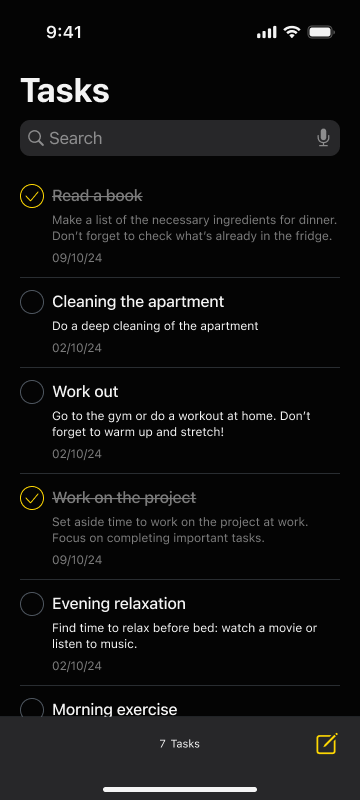
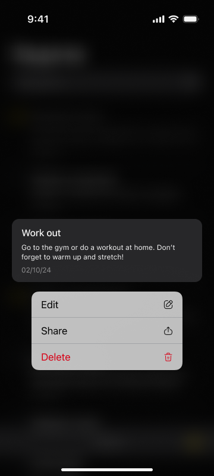
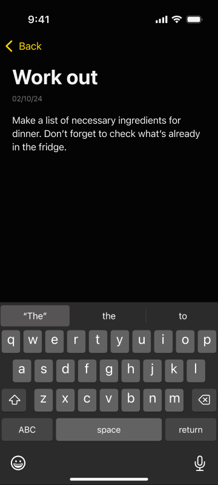

# ToDoList
The ToDoList app, built on VIPER, enables adding, editing, deleting, and searching tasks. Each task has a title, description, creation date, and status. Data is loaded from dummyjson API on first launch and stored in CoreData. All operations run asynchronously via GCD, and core logic is covered by unit tests.

---

## About ToDoList

**ToDoList** is a two-screen UIKit application built using the **VIPER** architectural pattern.  
The app was developed based on provided design layouts, with the primary goal of achieving pixel-perfect UI accuracy and leveraging Swift’s native components with fine-tuned customization.  
The architecture ensures strict separation of responsibilities, high scalability, and simplified testing.

---

## Project Description

The **ToDoList** app is designed to provide a fast and reliable task management experience with an emphasis on clean architecture and smooth asynchronous performance.  

### Core Functional Requirements

1. **Task Management (VIPER architecture)**  
   - Display a list of tasks on the main screen.  
   - Each task includes a **title**, **description**, **creation date**, and **status** (completed / not completed).  
   - Add new tasks.  
   - Edit existing tasks.  
   - Delete tasks.  
   - Search tasks by title or description.  

2. **Data Loading from DummyJSON API**  
   - On first launch, the app loads the task list from the API:  
     [https://dummyjson.com/todos](https://dummyjson.com/todos)  
   - The app retrieves task titles and completion states from the API, while the remaining fields (description, date, and unique ID) are generated automatically during decoding.  

3. **Multithreading (GCD)**  
   - All operations — create, load, edit, delete, and search — are executed in background threads using **Grand Central Dispatch (GCD)**.  
   - The UI remains fully responsive during asynchronous operations.  

4. **Persistent Storage (CoreData)**  
   - Tasks are persisted in CoreData.  
   - On subsequent launches, data is restored locally from CoreData without reloading from the network.  

5. **Unit Testing**  
   - Core business logic and key services are covered by **unit tests**, ensuring maintainability and reliability.  

---

## Architecture and Services

The app’s architecture is built entirely on **VIPER**, ensuring modularity and testability.  

- **Entity**  
  The `IToDo` entity conforms to `Identifiable` and `Codable`.  
  All services — network and storage — operate through abstractions and generics, which simplifies maintenance and allows for easy extension of entity fields.  

- **Services**  
  - **SettingsService** — stores the “first launch” flag in `UserDefaults` to determine whether to load data from CoreData or the API.  
  - **NetworkService** — universal networking layer; URLs are formed using `URLComponents` for safe request construction.  
  - **StorageService** — CoreData layer running in a background context (`performBackgroundTask`) to ensure thread safety and non-blocking UI updates.  
  - **TodoRepository** — orchestrator service combining the three above; it delegates requests based on the app state and ensures smooth data flow between persistence and network layers.  

- **Dependency Injection & Factories**  
  - **ScreenFactory** — builds fully configured view controllers with their presenter, interactor, and router.  
  - **DI Container** — manages dependencies across modules (VIPER-style).  

---

## Resources and Links

- **API Source:** [https://dummyjson.com/todos](https://dummyjson.com/todos)  
  On the first launch, data is fetched from this endpoint. Titles and completion flags are taken directly from the API; the rest of the fields are generated automatically during entity decoding.  

---

## Demo Screenshots

Below are screenshots of the **ToDoList** app in action:

  
  
  

---

## Technologies and Architecture

- **Language:** Swift 5+  
- **Frameworks:** UIKit, CoreData  
- **Architecture:** VIPER with Dependency Injection  
- **Asynchrony:** GCD (Grand Central Dispatch)  
- **Storage:** UserDefaults and CoreData via encapsulated services  
- **Testing:** Unit tests for Interactors, Repositories, and Services  
- **Target:** iOS 15.6+  

---

## Key Features

- **Clean VIPER architecture:** full separation of layers ensures scalability, testability, and easy maintenance.  
- **Universal repository layer:** combines CoreData, UserDefaults, and network operations through abstraction and generics.  
- **Thread-safe data operations:** all CRUD and fetch operations are performed asynchronously via GCD background queues.  
- **Persistent offline storage:** CoreData integration enables offline access and smooth data recovery on app relaunch.  
- **Strict adherence to design:** interface fully replicates the provided layout using UIKit components with precise customization.  
- **Reliable and maintainable codebase:** unit-tested core logic and clear dependency boundaries.  

---

## Usage

The **ToDoList** module can serve as a foundation for larger productivity or business apps requiring reliable task management and offline persistence.  
Its **VIPER architecture**, asynchronous CoreData operations, and strict modularization make it ideal for scaling, reusability, and enterprise-grade extensions such as cloud sync or push notifications.
